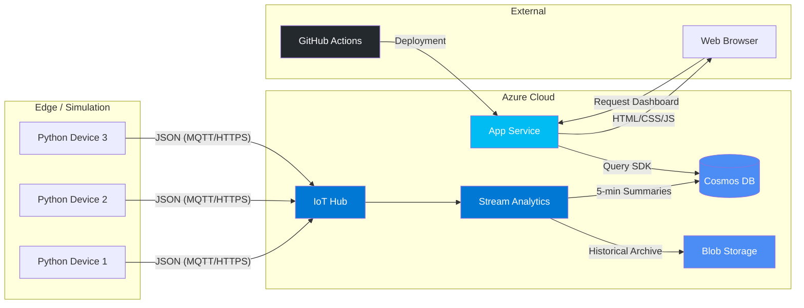

# Rideau Canal Skateway: Real-Time Monitoring System

**Student:** Divyang Lodariya  
**Student ID:** 041267894  
**Course:** CST8916  Remote Data and Real-time Applications  
**College:** Algonquin College, Ottawa  

---

## 1. Project Overview

The Rideau Canal in Ottawa is one of the longest skating rinks in the world. Every winter, the National Capital Commission (NCC) checks ice conditions to decide if it is safe for people to skate.

This project builds a system that monitors ice conditions automatically and in real-time. Instead of someone going out to check the ice manually, we simulate sensors placed at 3 locations along the canal. These sensors send data to the cloud every 10 seconds, and the system processes that data and shows it on a live dashboard.

---

## 2. Sensor Configurations

### 2.1 Sensor Locations

| Location | Parameters Monitored |
| :--- | :--- |
| **Dow's Lake** | Ice thickness, surface temp, snow, external temp |
| **Fifth Avenue** | Ice thickness, surface temp, snow, external temp |
| **NAC** | Ice thickness, surface temp, snow, external temp |

### 2.2 Safety Rules (NCC Standards)

| Status | Condition |
| :--- | :--- |
| ✅ **Safe** | Ice ≥ 30cm AND Surface Temp ≤ -2°C |
| ⚠️ **Caution** | Ice ≥ 25cm AND Surface Temp ≤ 0°C |
| ❌ **Unsafe** | Anything else |

---

## 3. System Architecture

---

## 4. Azure Services Utilized

- **Azure IoT Hub:** Acts as the central message hub. It receives and organizes incoming data from all three sensors.
- **Azure Stream Analytics:** The processing engine. It ingests the live stream and calculates 5-minute averages (min/max) and determines the safety status.
- **Azure Cosmos DB:** A high-performance database used to store the processed 5-minute summaries for dashboard retrieval.
- **Azure Blob Storage:** Used for long-term historical archiving of JSON data.
- **Azure App Service:** Hosts the web-based monitoring dashboard.

---

## 5. Data Flow Process

1. A Python script simulates three physical sensors.
2. Each sensor transmits a JSON message to Azure IoT Hub every 10 seconds.
3. Azure Stream Analytics processes the stream in real-time.
4. Every 5 minutes, it calculates averages and determines the safety status.
5. Data is persisted in Cosmos DB (live) and Blob Storage (history).
6. The Web Dashboard queries Cosmos DB to display the status.
7. The UI auto-refreshes every 30 seconds for the latest updates.

---

## 6. Project Resources

| Resource | Description | Link |
| :--- | :--- | :--- |
| Main Documentation | Architecture and query details | Current Repository |
| Sensor Simulator | Python IoT simulation code | [https://github.com/Divyang2599/rideau-canal-sensor-simulation] |
| Web Dashboard | Node.js & HTML Frontend | [https://github.com/Divyang2599/rideau-canal-dashboard] |

**Live Deployment:** [https://github.com/Divyang2599/rideau-canal-monitoring/tree/main/screenshots](# see all the screenshots)

---

## 7. Stream Analytics Implementation

The query logic is located in `stream-analytics/query.sql`.

**Key Concept:** The system utilizes a 5-minute Tumbling Window. This ensures that every 5 minutes, the system aggregates all readings within that specific window to produce one distinct summary per location. This provides a clean, non-overlapping dataset for the dashboard.

---

## 8. Evidence of Implementation (Screenshots)

All project screenshots are maintained in the `screenshots/` directory:

| Reference | Description |
| :--- | :--- |
| `01-iot-hub-devices.png` | IoT Hub showing 3 registered devices |
| `02-iot-hub-metrics.png` | IoT Hub message ingestion metrics |
| `03-stream-analytics-query.png` | The implemented SQL query logic |
| `04-stream-analytics-running.png` | Job status in "Running" state |
| `05-cosmos-db-data.png` | Processed documents within Cosmos DB |
| `06-blob-storage-files.png` | Archived JSON files in Blob Storage |
| `07-dashboard-local.png` | Localhost testing of the UI |
| `08-dashboard-azure.png` | Live production dashboard on Azure |

---

## 9. Setup and Deployment

### Prerequisites

- Active Azure Subscription
- Python 3.x
- Node.js 18+

### Implementation Steps

1. Provision an Azure Resource Group.
2. Deploy IoT Hub, Cosmos DB, and a Storage Account.
3. Register three IoT devices.
4. Configure Stream Analytics inputs/outputs.
5. Execute the Python sensor simulator.
6. Deploy the Node.js dashboard to Azure App Service.

---

## 10. Results and Findings

The system successfully automated the monitoring process. Below is a sample output from a typical 5-minute window:

| Location | Avg Ice Thickness | Avg Surface Temp | Status |
| :--- | :--- | :--- | :--- |
| Dow's Lake | 33.7 cm | -6.5°C | ✅ Safe |
| Fifth Avenue | 30.8 cm | -3.3°C | ✅ Safe |
| NAC | 35.2 cm | -9.4°C | ✅ Safe |

---

## 11. Challenges and Troubleshooting

- **Output Alias Mismatch:** The query initially failed due to a naming mismatch between the SQL input and the IoT Hub alias. Resolved by aligning naming conventions in the Azure Portal.
- **GitHub Secret Leaks:** Accidental push of connection strings was caught by Push Protection. I sanitized the `.env` files, amended the history, and rotated the Azure keys.
- **Database Connectivity:** Regenerating keys caused Stream Analytics to lose access. Resolved by updating the output sink credentials and restarting the job.
- **Python Environment Paths:** The `.env` file was not loading correctly depending on the execution directory. Resolved using `Path(__file__).parent` for absolute path referencing.

---

## 12. Video Demonstration

[YouTube Demo Link](#) *(Update with actual link)*

---

## 13. AI Utilization Statement

- **Tool:** Claude (Anthropic)
- **Application:** Code generation, debugging logic.

---
